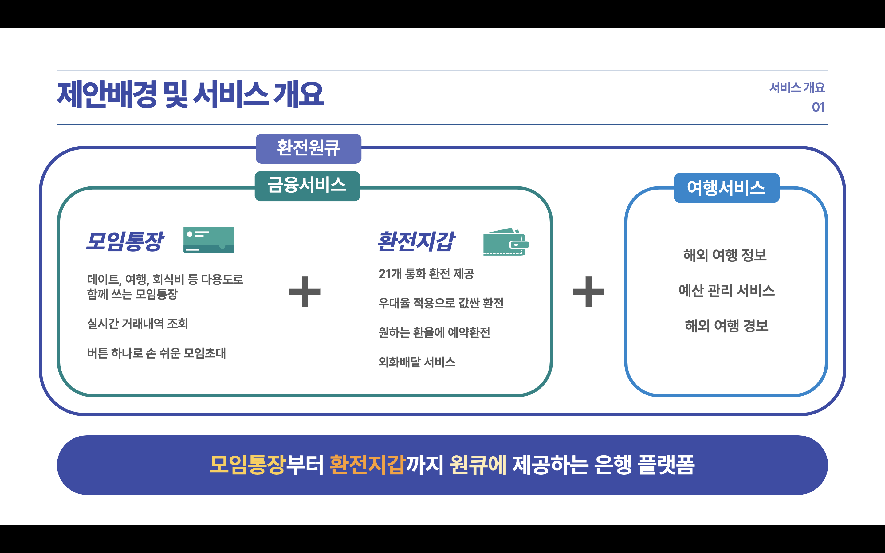
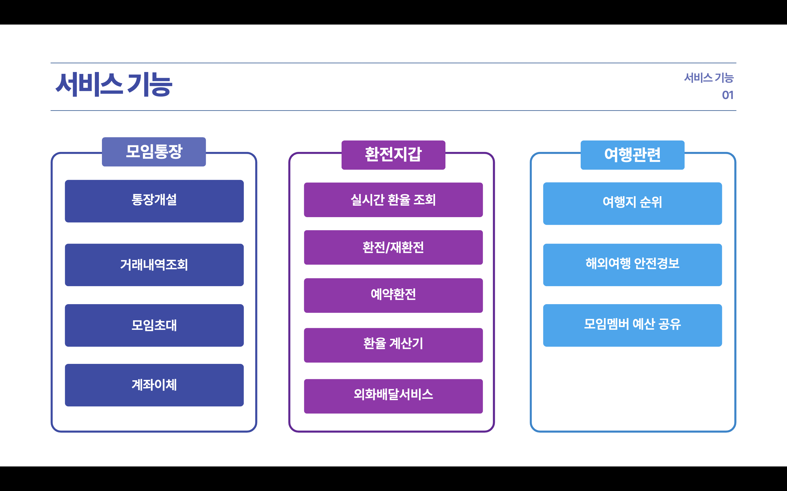
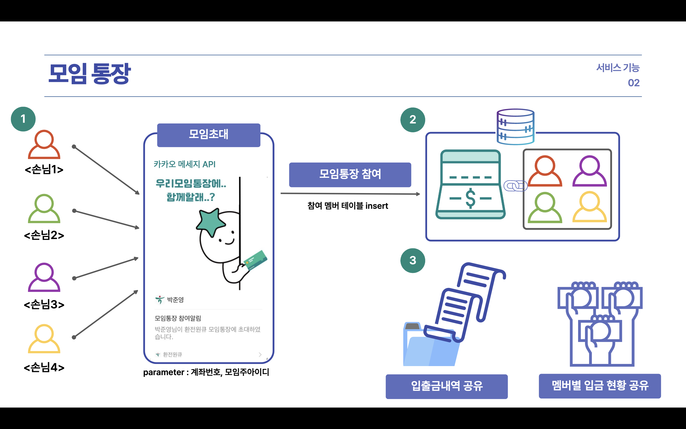
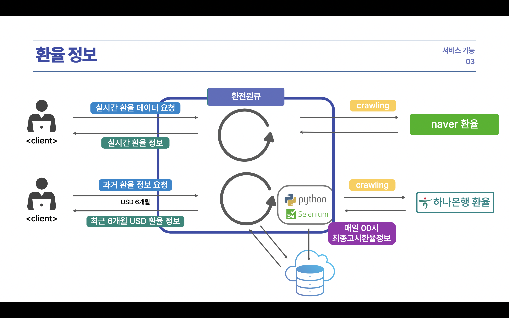
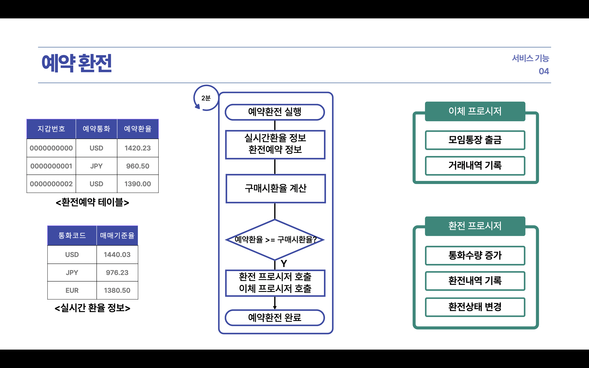
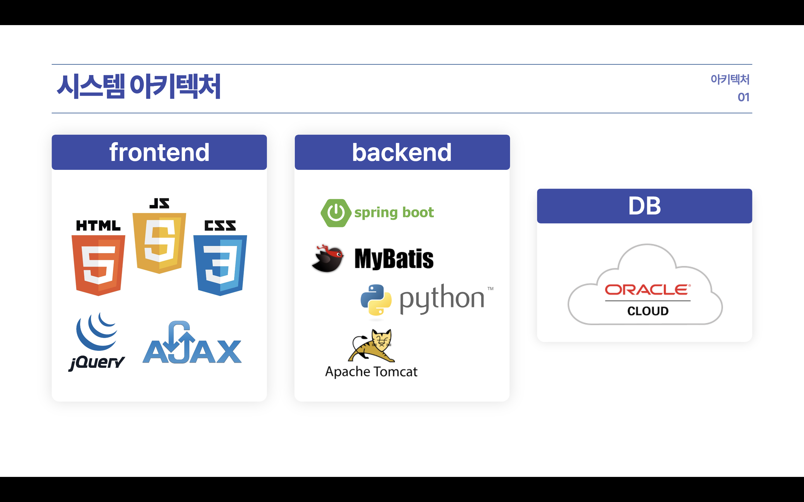
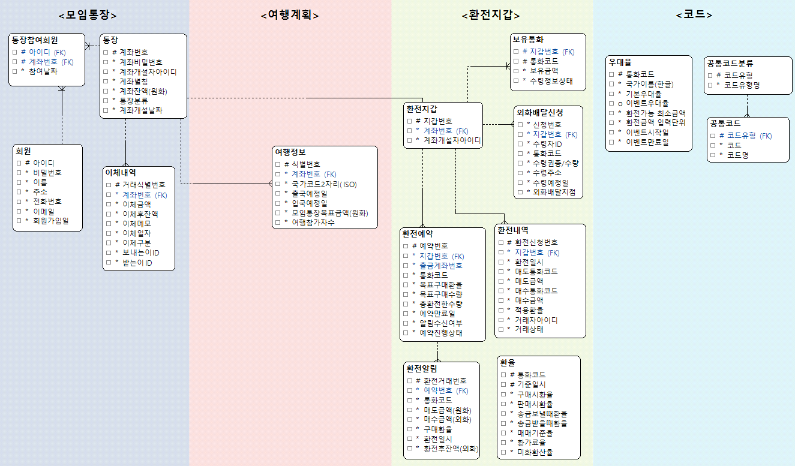
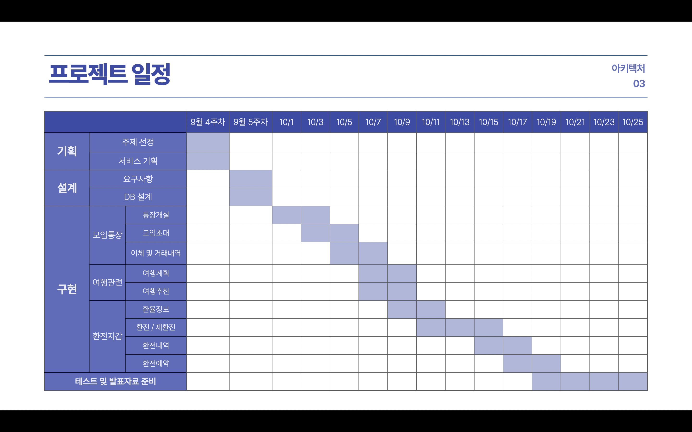

# 모임통장 환전지갑 그리고 여행까지! 환전원큐

[프로젝트 홈페이지 - https://koposoftware.github.io/2022_6_jypark/](https://koposoftware.github.io/2022_6_jypark/)

# 1. 프로젝트 개요
<br>
- 해외여행에 대한 관심과 출국자 수는 매년 증가하는 추세<br>
- 해외여행의 진행과정을 빠르게 도울 수 있는 모임통장과 환전지갑서비스를 제공하는 원큐 플랫폼

# 2. 서비스 기능
### 기능리스트
<br>
### 모임통장
<br>
### 환율정보
<br>
### 예약환전
<br>

# 3. 프로젝트 설계
### 개발환경
```
- OS : macOS Monterey
- DB : Oracle
- Language : Java, JavaScript, Python
- IDE : IntelliJ, VisualStudioCode, DataGrip
- Framework : SpringBoot, BootStrap, MyBatis
- Server : apache, tomcat9
- Cloud : Oracle Cloud
- VCS : Github
```
### 시스템 아키텍처
   <br>
### ERD
   <br>
### 프로젝트 일정
<br>

## 발표 ppt 
[발표자료](/발표ppt.pptx)<br>

## 시연 동영상 

  <iframe width="424" height="238" src="https://www.youtube.com/embed/reOGfxYJre0" title="YouTube video player" frameborder="0" allow="accelerometer; autoplay; clipboard-write; encrypted-media; gyroscope; picture-in-picture" allowfullscreen></iframe>

# 5. 본인 소개

|이름 |박준영||
|이메일 | pjy2958@naver.com|
|skill set| Frontend - HTML, CSS, Javascript|
| | Backend - Java, Python, C++|
| | Framework - SpringBoot, Bootstrap|
| | Etc - Git, Oracle Cloud|
|자격증| 2022년 SQLD |
|수상| 2020년 추계학술대회 대학생 논문/졸업작품 공모전 (한국IT서비스학회)  |
| | 2022년 한국폴리텍대학 프로젝트작품 경진대회(금상) (광명융합기술교육원)  |


